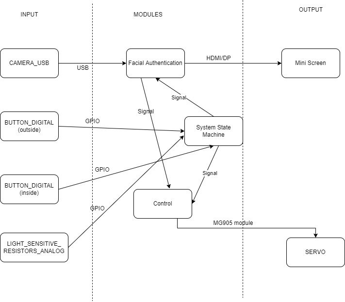
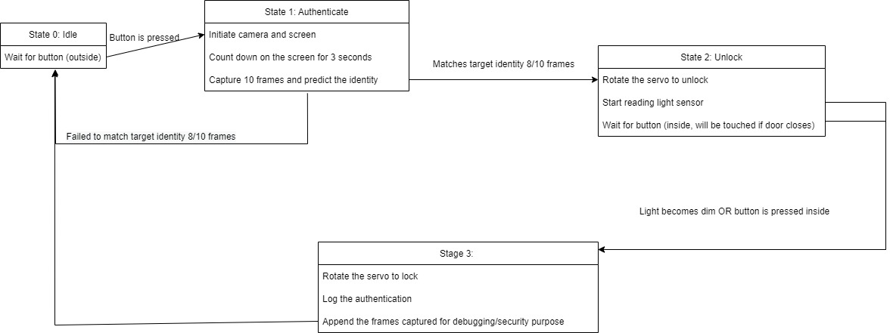

# Senior Design Proposal:  Smart Locker

## Totally not an Ordinary Locker

### Created by: Michael Rivera Ballesteros, Justin Grier, Kirollos Saad

The goal of this project is to build a locker that employs various features such as facial recognition, automatic lock, and data-driven technology that keeps track of user interactions. We selected this project because we desire to create a product that’s not only fun and lighthearted but also represents the college experience. Nothing comes close to as iconic and recognizable as the school locker and engineering students, we desire to exercise our skills and see how far we can re-invent the locker using electronic technology.

This project comprises both computer and electrical engineering skillsets, so to successfully reach our goal, we intend on using different components such as a bluetooth camera, servo, a servo motor driver, a 4 inch HDMI LED display, and a battery power supply. We intend on modifying a regular locker storage cabinet into a smart device using python and a jetson nano. Our team will work primarily on code, research, and development and hardware design. 

#### Proposed System IO Map

#### Proposed System State Machine Map

#### Main Features: 
Facial Recognition. 

Automatic Lock. 

Screen Display ( time, date, etc). 

Manuel open: Emergency access. 

#### Potential Features:
Text messages when locked/unlocked for security purposes. 
LED light for locked and unlocked
App development
GPS
More features as we progress.

#### Credited Online sources
https://www.youtube.com/watch?v=uvU8AXY1170
https://maker.pro/nvidia-jetson/tutorial/how-to-use-gpio-pins-on-jetson-nano-developer-kit
https://arxiv.org/ftp/arxiv/papers/1804/1804.07573.pdf
https://www.allaboutcircuits.com/technical-articles/the-i2c-bus-hardware-implementation-details/
